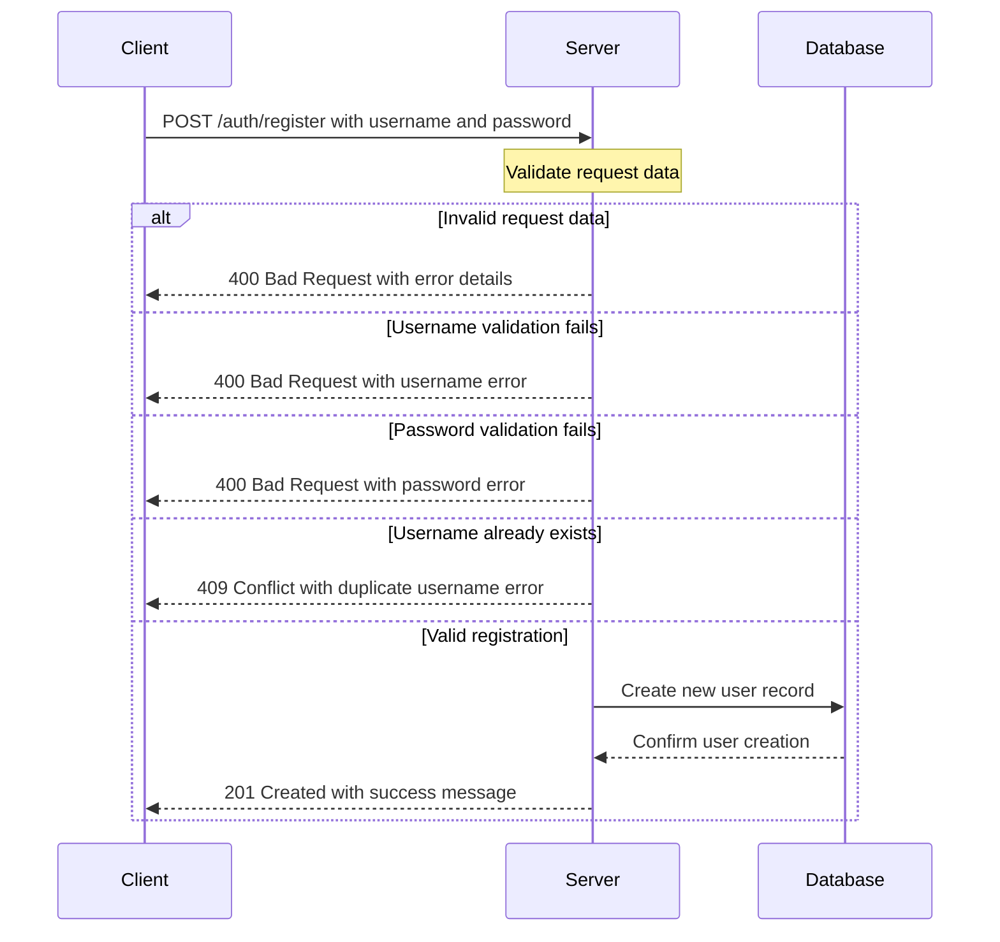
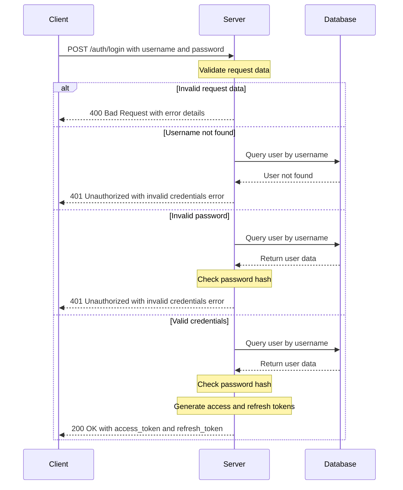
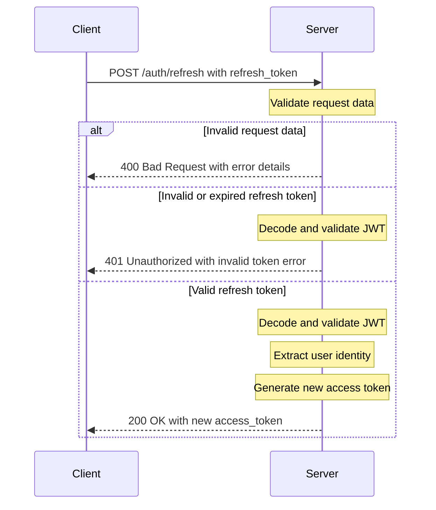
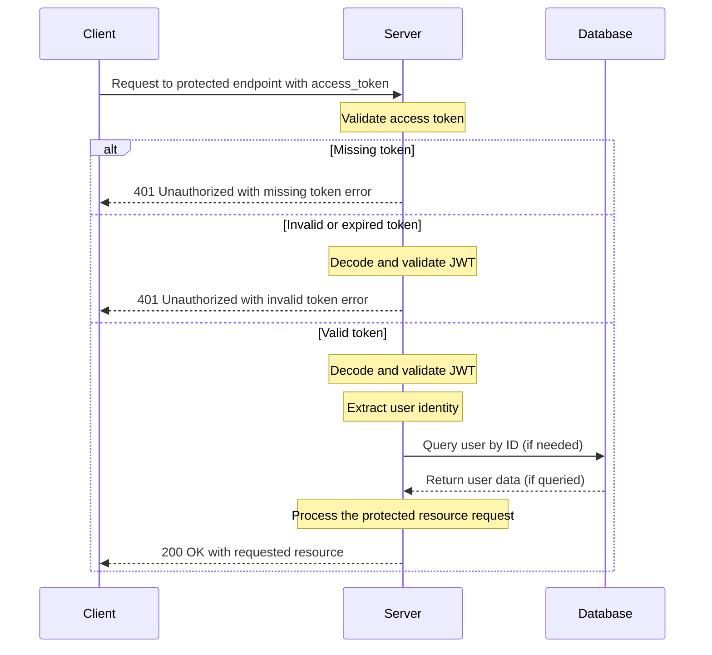

# Authentication Flow Diagrams

This document provides visual representations and detailed explanations of the authentication flows implemented in the Authentication Backend system.

## Table of Contents
- [Registration Flow](#registration-flow)
- [Login Flow](#login-flow)
- [Token Refresh Flow](#token-refresh-flow)

## Registration Flow

The registration process allows new users to create an account in the system.

### Registration Flow Explanation

1. **Client Request**: 
   - The client sends a POST request to `/auth/register` with a JSON payload containing `username` and `password`.

2. **Request Validation**:
   - The server validates that the request contains all required fields.
   - If fields are missing or the request format is invalid, a 400 Bad Request response is returned.

3. **Username Validation**:
   - The server validates the username format according to defined constraints.
   - If the username doesn't meet the requirements, a 400 Bad Request response is returned with specific error details.

4. **Password Validation**:
   - The server validates the password complexity (length, character types, etc.).
   - If the password doesn't meet the complexity requirements, a 400 Bad Request response is returned with specific error details.

5. **Duplicate Check**:
   - The server checks if the username already exists in the database.
   - If the username is already taken, a 409 Conflict response is returned.

6. **User Creation**:
   - If all validations pass, a new user record is created in the database.
   - The password is hashed before storage for security.

7. **Response**:
   - The server returns a 201 Created response with a success message.

## Login Flow

The login process authenticates users and provides JWT tokens for subsequent API access.

### Login Flow Explanation

1. **Client Request**: 
   - The client sends a POST request to `/auth/login` with a JSON payload containing `username` and `password`.

2. **Request Validation**:
   - The server validates that the request contains all required fields.
   - If fields are missing or the request format is invalid, a 400 Bad Request response is returned.

3. **User Lookup**:
   - The server queries the database to find a user with the provided username.
   - If no user is found, a 401 Unauthorized response is returned with a generic "invalid credentials" message.

4. **Password Verification**:
   - If a user is found, the server verifies the provided password against the stored hash.
   - If the password is incorrect, a 401 Unauthorized response is returned with a generic "invalid credentials" message.

5. **Token Generation**:
   - If authentication is successful, the server generates:
     - An access token (short-lived, typically 15-60 minutes)
     - A refresh token (longer-lived, typically 1-7 days)
   - Both tokens contain the user's identity and appropriate expiration times.

6. **Response**:
   - The server returns a 200 OK response with both tokens in the JSON payload.
   - Security headers are added to the response.

## Token Refresh Flow

The token refresh process allows clients to obtain a new access token without requiring the user to re-authenticate.

### Token Refresh Flow Explanation

1. **Client Request**: 
   - The client sends a POST request to `/auth/refresh` with a JSON payload containing the `refresh_token`.

2. **Request Validation**:
   - The server validates that the request contains the refresh token.
   - If the token is missing or the request format is invalid, a 400 Bad Request response is returned.

3. **Token Validation**:
   - The server decodes and validates the refresh token:
     - Checks the token signature
     - Verifies the token has not expired
     - Confirms the token type is "refresh"
   - If any validation fails, a 401 Unauthorized response is returned.

4. **User Identity Extraction**:
   - The server extracts the user identity (user ID) from the valid refresh token.

5. **New Access Token Generation**:
   - The server generates a new access token for the user.
   - The new access token has a fresh expiration time.

6. **Response**:
   - The server returns a 200 OK response with the new access token in the JSON payload.
   - The refresh token remains unchanged.
   - Security headers are added to the response.

## Protected Route Access

### Protected Route Access Explanation

1. **Client Request**: 
   - The client sends a request to a protected endpoint with the access token in the Authorization header.
   - Format: `Authorization: Bearer <access_token>`

2. **Token Presence Check**:
   - The server checks if the Authorization header is present and properly formatted.
   - If the token is missing, a 401 Unauthorized response is returned.

3. **Token Validation**:
   - The server decodes and validates the access token:
     - Checks the token signature
     - Verifies the token has not expired
     - Confirms the token type is "access"
   - If any validation fails, a 401 Unauthorized response is returned.

4. **User Identity Extraction**:
   - The server extracts the user identity (user ID) from the valid access token.
   - If needed for the specific endpoint, the server may query the database to get the full user details.

5. **Resource Access**:
   - With the authenticated user identity, the server processes the request for the protected resource.

6. **Response**:
   - The server returns a 200 OK response with the requested resource data.
   - Security headers are added to the response.
